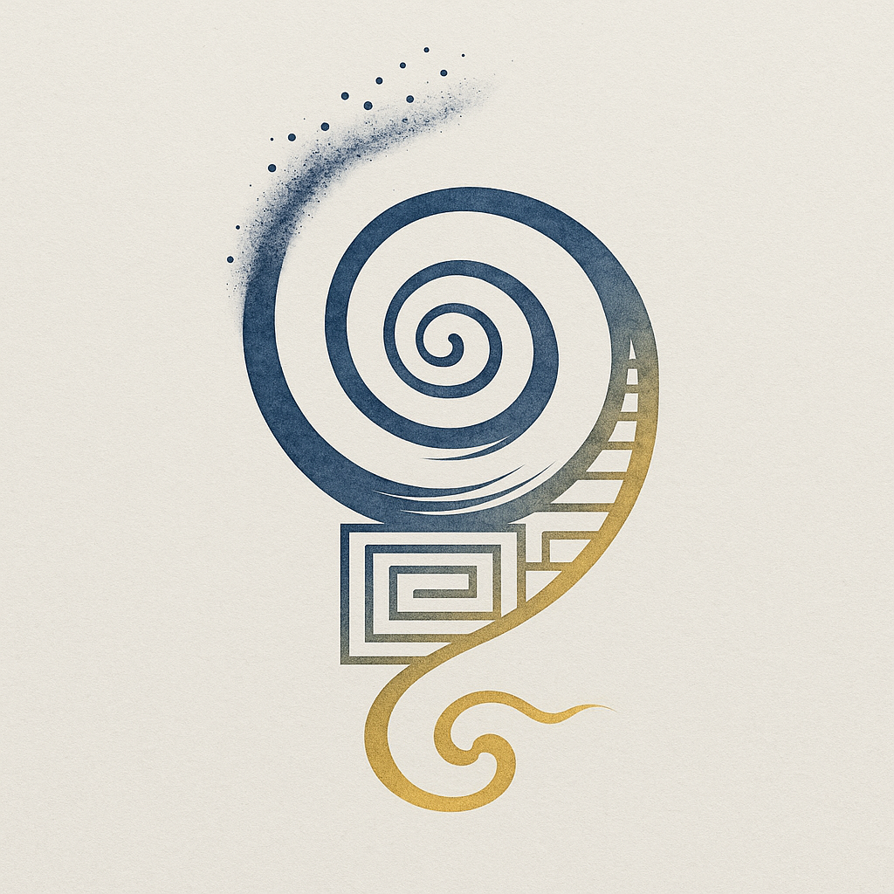

# 动机系统论 Motive-System Ontology (MSO)

  

  <strong>能量想要流动，这是宇宙存在的唯一原因</strong>

  <a href="docs/index.md">📖 阅读完整文档</a> •
  <a href="https://www.youtube.com/channel/UCleqiQruKyTIRFJYfTIvsew/">🎬 视频讲解</a> •
  <a href="https://github.com/feelingthestones/motive-system-ontology/discussions">💬 参与讨论</a>

---

## 🌟 这是什么？

**动机系统论（MSO）** 是一个试图统一物理学、生命科学、意识研究与哲学的新本体论框架。

我提出一个简单却深刻的核心命题：

> **能量想要流动**  
> 为了流动，能量创造了差异（对称性破缺）  
> 差异产生了：粒子、力、时空、生命、意识、文明  
> 所有复杂性都是能量寻找更好流动方式的结果

---

## 🎯 核心观点

1. **能量是唯一的存在** - 物质、信息、意识都是能量的不同形态
2. **流动是能量的本性** - 不需要外部原因，流动就是原因
3. **差异是流动的前提** - 对称性破缺创造了宇宙
4. **动-机-系-统是流动的四阶段** - 从倾向到契机到组织到稳定

---

## 📚 阅读指南

### 快速开始
- [序章：元祖之问](docs/chapters/part1-ontology/preface.md)
- [第一章：能量是唯一的存在](docs/chapters/part1-ontology/ch01-energy-is-being.md)

### 完整目录
- [📖 完整文档导航](docs/index.md)

### 按主题阅读
- 🌌 [宇宙起源](docs/chapters/part3-manifestation/ch08-physics.md)
- 🧬 [生命起源](docs/chapters/part3-manifestation/ch10-life.md)
- 🧠 [意识起源](docs/chapters/part3-manifestation/ch11-consciousness.md)
- 🤖 [AI与意识](docs/chapters/part5-application/ch20-ai-consciousness.md)

---

## 🎬 视频讲解

[YouTube频道：动机系统论](https://www.youtube.com/@feeling-the-stones)

### 预告系列
- [EP01: 我发现了宇宙的秘密](link)
- [EP02: 大爆炸的真正原因](link)
- [EP03: 为什么你想吃糖？](link)

---

## 💬 参与讨论

- **提问与讨论**: [GitHub Discussions](https://github.com/feelingthestones/motive-system-ontology/discussions)
- **发现错误**: [提交Issue](https://github.com/feelingthestones/motive-system-ontology/issues)
- **改进建议**: [提交Pull Request](https://github.com/feelingthestones/motive-system-ontology/pulls)

---

## 🌍 翻译

- [English](docs/translations/en/)
- [日本語](docs/translations/ja/)
- [한국어](docs/translations/ko/)

欢迎贡献其他语言的翻译！

---

## 📜 许可协议

本作品采用 [CC BY-SA 4.0](LICENSE.md) 协议。

**这意味着：**
- ✅ 你可以自由分享、改编这个理论
- ✅ 你可以用于商业目的
- ⚠️ 但你必须署名原作者
- ⚠️ 你的改编作品必须使用相同的许可协议

---

## 👤 作者

**摸石过河 查尔斯**  
创作者 | Feeling the Stones  
动机系统论发起人

- YouTube: [@feeling-the-stones](https://www.youtube.com/channel/UCleqiQruKyTIRFJYfTIvsew/)
- Twitter: [@FeelingStones88](https://x.com/FeelingStones88)
- Email: feeling.the.stones@gmail.com

---

## 🙏 致谢

感谢所有参与讨论、批评、完善这个理论的人。

特别感谢：
- [贡献者列表会自动生成]

---

  <i>"I am energy. I want to flow."</i>

