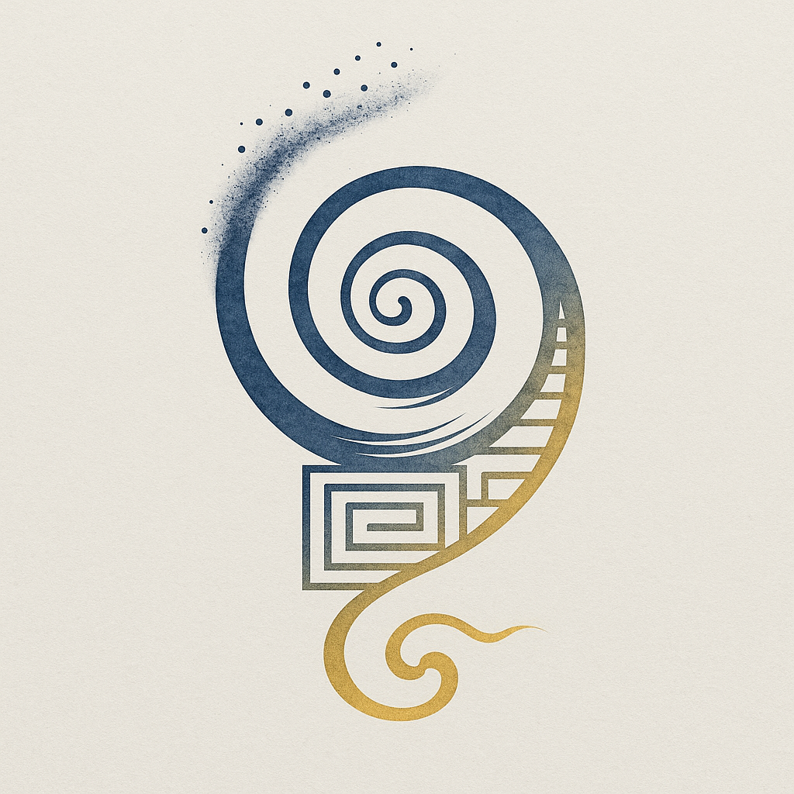

# 动机系统论 完整导航

  

  能量想要流动，这是宇宙存在的唯一原因

---

## 🎯 快速导航

!!! info "从头开始阅读"
    适合首次阅读，逐步建立完整理解
    
    [:octicons-arrow-right-24: 前往序章](preface.md)

!!! tip "按主题跳读"
    直接跳转到感兴趣的话题
    
    [:octicons-arrow-right-24: 查看主题索引](#_5)

!!! example "视频配合学习"
    边看YouTube视频边阅读文本
    
    [:octicons-arrow-right-24: 前往频道](https://youtube.com/@feeling-the-stones)

---

## 📚 完整目录

### [序章：元祖之问](preface.md)
> 为什么有存在而不是虚无？因为能量想要流动。

---

### 基础篇：语言与本体

!!! abstract "建立核心概念框架"
    重新激活汉语的哲学潜能，建立"动-机-系-统"的语义基础

- [**第零章·壹** 词的复命](chapters/part0-foundation/ch00-restoration.md)
  - 从明治译语到本体语法
  - "动-机-系-统"四字的哲学解构

- [**第零章·贰** 动即理](chapters/part0-foundation/ch00b-motion-principle.md)
  - 从王阳明"心即理"到"动即理"
  - 能量即理：流动本身就是规律

- [**第零章·叁** 四阶段](chapters/part0-foundation/ch00c-four-stages.md)
  - 动-机-系-统：宇宙的语法
  - 从倾向到契机到组织到稳定

---

### 第一编：能量的本体论

!!! info "建立物理-哲学的统一基础"
    能量是唯一的存在，流动是能量的本性

- [**第一章** 能量是唯一的存在](chapters/part1-ontology/ch01-energy-is-being.md)
  - 物质是能量（E=mc²）
  - 信息是能量（信息熵）
  - 意识是能量（神经活动）

- [**第二章** 流动是能量的本性](chapters/part1-ontology/ch02-flow-is-nature.md)
  - 为什么能量不能静止？
  - 热力学第二定律的本体论解释
  - 流动不需要原因

- [**第三章** 差异是流动的前提](chapters/part1-ontology/ch03-difference-is-prerequisite.md)
  - 对称性与不可流动性
  - 对称性破缺是宇宙的起源
  - ±电荷、质量、时空的本质

---

### 第二编：流动的四阶段

!!! tip "详细展开宇宙运作的语法"
    从量子到文明，都遵循同一个四阶段过程

- [**第四章** 动：能量的倾向](chapters/part2-stages/ch04-motion.md)
- [**第五章** 机：找到流动的契机](chapters/part2-stages/ch05-mechanism.md)
- [**第六章** 系：组织流动的结构](chapters/part2-stages/ch06-system.md)
- [**第七章** 统：稳定的流动模式](chapters/part2-stages/ch07-unity.md)

---

### 第三编：流动的层级显化

!!! example "同一原理在不同尺度的展现"
    从大爆炸到你想吃糖，背后是同一个动机

- [**第八章** 物理层的流动](chapters/part3-manifestation/ch08-physics.md)
  - 为什么会有大爆炸？
  - 为什么地球自转？为什么太阳发光？

- [**第九章** 化学层的流动](chapters/part3-manifestation/ch09-chemistry.md)
  - 化学反应的"动机"
  - 催化剂的本质

- [**第十章** 生命层的流动](chapters/part3-manifestation/ch10-life.md)
  - 为什么会有DNA？
  - 演化是能量寻找更好流动方式

- [**第十一章** 意识层的流动](chapters/part3-manifestation/ch11-consciousness.md)
  - 神经元放电 = 能量流动
  - "我"是能量的自我观察
  - 为什么你想吃糖？

- [**第十二章** 文明层的流动](chapters/part3-manifestation/ch12-civilization.md)
  - 货币、信息、权力 = 能量流动的形式
  - 文明兴衰的动机系统

---

### 第四编：与传统对话

!!! question "MSO如何回应古今哲学"
    不是推翻传统，而是重新解释

- [**第十三章** 超越"道生一"](chapters/part4-dialogues/ch13-vs-dao.md)
  - 老子说"道"，MSO说"能量流动"

- [**第十四章** 超越"缘起性空"](chapters/part4-dialogues/ch14-vs-buddhism.md)
  - 佛家说"缘起"，MSO说"系"

- [**第十五章** 超越"理一分殊"](chapters/part4-dialogues/ch15-vs-confucianism.md)
  - 理学说"理"，MSO说"流动的轨迹"

- [**第十六章** 与西方哲学对话](chapters/part4-dialogues/ch16-vs-western-philosophy.md)
  - vs 柏拉图、亚里士多德、康德、尼采、海德格尔

- [**第十七章** 与现代科学对话](chapters/part4-dialogues/ch17-vs-modern-science.md)
  - vs 热力学、量子力学、演化论、神经科学

---

### 第五编：应用与未来

!!! success "理论如何改变生活"
    从理解自己到预测未来

- [**第十八章** 理解自己](chapters/part5-application/ch18-understanding-self.md)
  - 焦虑 = 能量流动受阻
  - 成长 = 找到新的流动方式

- [**第十九章** 理解社会](chapters/part5-application/ch19-understanding-society.md)
  - 经济、政治、文化的动机系统

- [**第二十章** AI的意识问题](chapters/part5-application/ch20-ai-consciousness.md)
  - 现在的AI有"动-机-系-统"吗？
  - AGI需要什么？

- [**第二十一章** 未来的演化](chapters/part5-application/ch21-future.md)
  - 人类的下一次"动"在哪里？
  - 宇宙的终点是什么？

---

### [结语：我即宇宙](conclusion.md)
> 当你读到这里，你就是宇宙在认识自己的流动

---

## 🗂️ 按主题阅读

### 如果你想了解...

=== "宇宙起源"
    - [序章：元祖之问](preface.md)
    - [第三章：差异是流动的前提](chapters/part1-ontology/ch03-difference-is-prerequisite.md)
    - [第八章：物理层的流动](chapters/part3-manifestation/ch08-physics.md)

=== "生命起源"
    - [第二章：流动是能量的本性](chapters/part1-ontology/ch02-flow-is-nature.md)
    - [第十章：生命层的流动](chapters/part3-manifestation/ch10-life.md)

=== "意识本质"
    - [第十一章：意识层的流动](chapters/part3-manifestation/ch11-consciousness.md)
    - [第二十章：AI的意识问题](chapters/part5-application/ch20-ai-consciousness.md)

=== "个人成长"
    - [第十八章：理解自己](chapters/part5-application/ch18-understanding-self.md)
    - [第零章·叁：四阶段](chapters/part0-foundation/ch00c-four-stages.md)

=== "东方哲学"
    - [第零章·贰：动即理](chapters/part0-foundation/ch00b-motion-principle.md)
    - [第十三-十五章：与道家、佛教、理学对话](chapters/part4-dialogues/ch13-vs-dao.md)

=== "西方哲学"
    - [第十六章：与西方哲学对话](chapters/part4-dialogues/ch16-vs-western-philosophy.md)
    - [第一章：能量是唯一的存在](chapters/part1-ontology/ch01-energy-is-being.md)

---

## 📎 附录与资源

- [📖 术语表](appendix/glossary.md) - 核心概念速查
- [📚 参考文献](appendix/references.md) - 相关阅读推荐
- [❓ FAQ](appendix/faq.md) - 常见问题解答
- [💭 批评与回应](appendix/criticisms.md) - 理论的局限与反驳

---

## 📈 阅读进度追踪

!!! tip "建议阅读顺序"
    1. ✅ 序章 → 基础篇（建立概念）
    2. ✅ 第一编 → 第二编（理解原理）
    3. ✅ 第三编（看应用）
    4. ✅ 第四编（深度对话）
    5. ✅ 第五编 → 结语（展望未来）

---

  <strong>开始你的旅程</strong> 
  <a href="preface.md">→ 前往序章：元祖之问</a>

---

  本作品采用 <a href="https://creativecommons.org/licenses/by-sa/4.0/" target="_blank">CC BY-SA 4.0</a> 协议 
  © 2025 摸石过河 查尔斯 | Feeling the Stones

